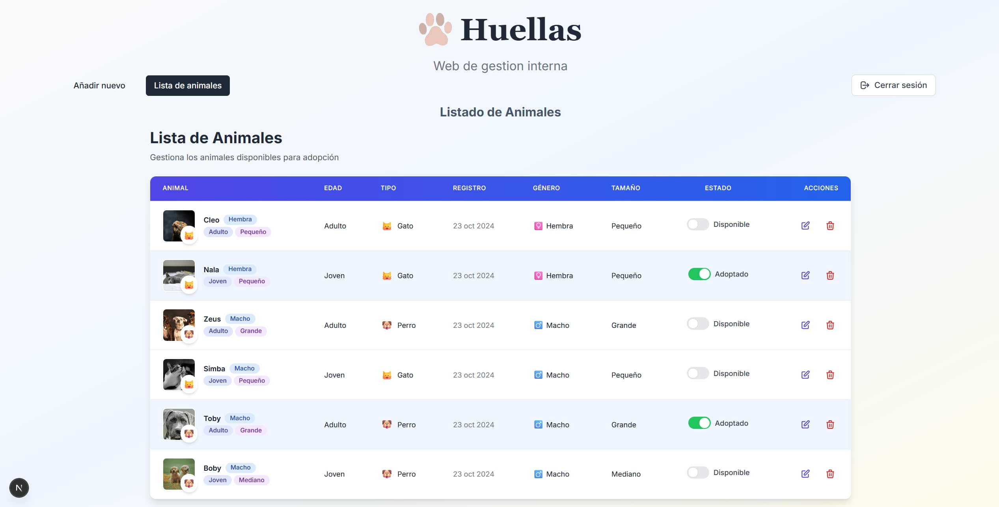

# 🐾 Fido - Sistema de Gestión Interna para Protectora de Animales

---

## 📸 Captura de pantalla

_Añade aquí una imagen representativa de la aplicación_



---

## 📝 Descripción

Huellas es una aplicación web interna diseñada para la gestión eficiente de los datos de la protectora de animales **Huellas**. Permite a los usuarios autorizados agregar, editar y eliminar registros de animales, gestionar imágenes de manera optimizada y mantener la información segura mediante autenticación.

## ⭐ Características principales

- 📋 Formulario intuitivo para agregar nuevos animales
- 🗄️ Base de datos rápida y ligera con **TURSO**
- 💻 Interfaz moderna con Next.js, TypeScript, TailwindCSS y componentes shadcn
- 🖼️ Procesamiento automático de imágenes con Sharp (optimización y marca de agua)
- ☁️ Almacenamiento seguro de imágenes en Cloudinary
- 🔐 Autenticación robusta de usuarios con AuthJS
- ✏️ Edición y eliminación sencilla de registros existentes

## 🛠️ Tecnologías utilizadas

- ⚡ **Next.js**
- 📘 **TypeScript**
- 🎨 **TailwindCSS**
- 🔧 **Sharp**
- ☁️ **Cloudinary**
- 🔒 **AuthJS**
- 💾 **TURSO** (base de datos)

## 🚀 Instalación y uso

1. **Clonar el repositorio:**
   ```bash
   git clone [URL_DEL_REPOSITORIO]
   ```
2. **Instalar dependencias:**
   ```bash
   npm install
   ```
3. **Ejecutar en modo desarrollo:**
   ```bash
   npm run dev
   ```
4. **Abrir en el navegador:**
   ```bash
   http://localhost:3000
   ```

> **Nota:** Se requiere autenticación para acceder a la aplicación.

## ✅ Tareas realizadas

- [x] Restringir el selector de archivos a imágenes y limitar la cantidad a 5
- [x] Ampliar el ancho del formulario de edición
- [x] Mejorar el breakpoint para el responsive
- [x] Modificar la fecha de la base de datos a timestamp
- [x] Crear pantalla de login
- [x] Añadir autenticación con AuthJS
- [x] Corregir la funcionalidad del check de adopción
- [x] Añadir modal de edición de animales
- [x] Ajustar la marca de agua en imágenes
- [x] Eliminar imágenes de Cloudinary al borrar registros
- [x] Implementar procesamiento de imágenes con Sharp
- [x] Crear loading para envío de formularios
- [x] Añadir miniaturas en la tabla de registros
- [x] Implementar actualización de estado de adopción
- [x] Añadir confirmación para eliminación de registros
- [x] Configurar variables de entorno seguras
- [x] Revisar y configurar ESLint
- [x] Implementar conexión con Cloudinary
- [x] Crear vista para gestión de registros (CRUD)

---

_Si tienes dudas, sugerencias o quieres contribuir, no dudes en abrir un issue o pull request._

## 🤝 Contribución

Para contribuir al proyecto, por favor sigue estos pasos:

1. Haz un fork del repositorio
2. Crea una nueva rama (`git checkout -b feature/AmazingFeature`)
3. Realiza tus cambios y haz commit (`git commit -m 'Add some AmazingFeature'`)
4. Push a la rama (`git push origin feature/AmazingFeature`)
5. Abre un Pull Request

## 📲 Contacto

Para cualquier consulta o información adicional, puedes contactarme en:

- Email: efe13dev@gmail.com
